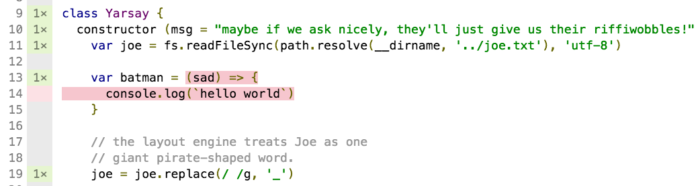
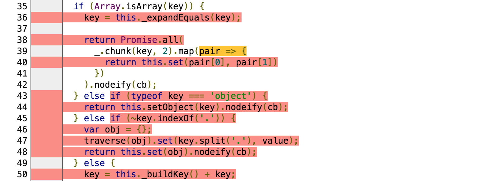

# nyc

[](https://travis-ci.org/bcoe/nyc)
[](https://coveralls.io/r/bcoe/nyc?branch=)
[](https://www.npmjs.com/package/nyc)
[](https://ci.appveyor.com/project/bcoe/nyc)
[](https://github.com/conventional-changelog/standard-version)

a code coverage tool built on [istanbul](https://www.npmjs.com/package/istanbul)
that works for applications that spawn subprocesses.

## Instrumenting Your Code

You can install nyc as a development dependency and add it to the test stanza
in your package.json.

```shell
npm i nyc --save-dev
```

```json
{
  "script": {
    "test": "nyc tap ./test/*.js"
  }
}
```

Alternatively, you can install nyc globally and use it to execute `npm test`:

```shell
npm i nyc -g
```

```shell
nyc npm test
```

nyc accepts a wide variety of configuration arguments, run `nyc --help` for
thorough documentation.

Configuration arguments should be provided prior to the program that nyc
is executing. As an example, the following command executes `npm test`,
and indicates to nyc that it should output both an `lcov`
and a `text-lcov` coverage report.

```shell
nyc --reporter=lcov --reporter=text-lcov npm test
```

## Support For Custom Require Hooks (Babel! ES2015!)

nyc supports custom require hooks like
[`babel-register`](http://babeljs.io/docs/usage/require/). If necessary nyc can
load the hooks for you, [using the `--require`
flag](#require-additional-modules).

Source maps are used to map coverage information back to the appropriate lines
of the pre-transpiled code. You'll have to configure your custom require hook
to inline the source map in the transpiled code. For Babel that means setting
the `sourceMaps` option to `inline`.

## Use babel-plugin__coverage__ for Better ES6/ES7 Support

[`babel-plugin-__coverage__`](https://github.com/dtinth/babel-plugin-__coverage__) can be used to enable better first-class ES6 support.

1. enable the `__coverage__` plugin:

  ```json
    {
      "babel": {
        "presets": ["es2015"],
        "plugins": ["__coverage__"]
      }
    }
  ```

2. disable nyc's instrumentation and source-maps:

  ```json
  {
    "nyc": {
      "include": [
        "src/*.js"
      ],
      "require": [
        "babel-register"
      ],
      "sourceMap": false,
      "instrument": false
    }
  }
  ```

That's all there is to it, better ES6 syntax highlighting awaits:



## Support For Custom File Extensions (.jsx, .es6)

Supporting file extensions can be configured through either the configuration arguments or with the `nyc` config section in `package.json`.

```shell
nyc --extension .jsx --extension .es6 npm test
```

```json
{
  "nyc": {
    "extension": [
      ".jsx",
      ".es6"
    ]
  }
}
```

## Checking Coverage

nyc exposes istanbul's check-coverage tool. After running your tests with nyc,
simply run:

```shell
nyc check-coverage --lines 95 --functions 95 --branches 95
```

This feature makes it easy to fail your tests if coverage drops below a given threshold.

nyc also accepts a `--check-coverage` shorthand, which can be used to
both run tests and check that coverage falls within the threshold provided:

```shell
nyc --check-coverage --lines 100 npm test
```

The above check fails if coverage falls below 100%.

## Running Reports

Once you've run your tests with nyc, simply run:

```bash
nyc report
```

To view your coverage report:



you can use any reporters that are supported by istanbul:

```bash
nyc report --reporter=lcov
```

## Excluding Files

You can tell nyc to exclude specific files and directories by adding
an `nyc.exclude` array to your `package.json`. Each element of
the array is a glob pattern indicating which paths should be omitted.

Globs are matched using [micromatch](https://www.npmjs.com/package/micromatch).

In addition to patterns specified in the package, nyc will always exclude
files in `node_modules`.

For example, the following config will exclude everything in `node_modules`,
any files with the extension `.spec.js`, and anything in the `build`
directory:

```json
{
  "nyc": {
    "exclude": [
      "**/*.spec.js",
      "build"
    ]
  }
}
```

> Note: exclude defaults to `['test', 'test{,-*}.js', '**/*.test.js', '**/__tests__/**']`,
which would exclude `test`/`__tests__` directories as well as `test.js`, `*.test.js`,
and `test-*.js` files. Specifying your own exclude property overrides these defaults.

## Including Files

As an alternative to providing a list of files to `exclude`, you can provide
an `include` key to specify specific files that should be covered:

```json
{
  "nyc": {
    "include": ["**/build/umd/moment.js"]
  }
}
```

> Note: include defaults to `['**']`

## Include Reports For Files That Are Not Required

By default nyc does not collect coverage for files that have not
been required, run nyc with the flag `--all` to enable this.

## Require additional modules

The `--require` flag can be provided to `nyc` to indicate that additional
modules should be required in the subprocess collecting coverage:

`nyc --require babel-core/register --require babel-polyfill mocha`

## Caching

You can run `nyc` with the optional `--cache` flag, to prevent it from
instrumenting the same files multiple times. This can signficantly
improve runtime performance.

## Configuring `nyc`

Any configuration options that can be set via the command line
can also be specified in the `nyc` stanza of your package.json:

```json
{
  "nyc": {
    "lines": 99,
    "check-coverage": false,
    "report-dir": "./alternative"
  }
}
```

## Configuring Istanbul

Behind the scenes nyc uses [istanbul](https://www.npmjs.com/package/istanbul). You
can place a `.istanbul.yml` file in your project's root directory to pass config
setings to istanbul's code instrumenter:

```yml
instrumentation:
  preserve-comments: true
```

## Integrating With Coveralls

[coveralls.io](https://coveralls.io) is a great tool for adding
coverage reports to your GitHub project. Here's how to get nyc
integrated with coveralls and travis-ci.org:

1. add the coveralls and nyc dependencies to your module:

  ```shell
  npm install coveralls nyc --save
  ```

2. update the scripts in your package.json to include these bins:

  ```json
  {
     "script": {
       "test": "nyc tap ./test/*.js",
       "coverage": "nyc report --reporter=text-lcov | coveralls"
     }
  }
  ```

3. For private repos, add the environment variable `COVERALLS_REPO_TOKEN` to travis.

4. add the following to your `.travis.yml`:

  ```yaml
  after_success: npm run coverage
  ```

That's all there is to it!

> Note: by default coveralls.io adds comments to pull-requests on GitHub, this can feel intrusive. To disable this, click on your repo on coveralls.io and uncheck `LEAVE COMMENTS?`.


## Integrating with codecov

`nyc npm test && nyc report --reporter=text-lcov > coverage.lcov && codecov`

[codecov](https://codecov.io/) is a great tool for adding
coverage reports to your GitHub project, even viewing them inline on GitHub with a browser extension:

Here's how to get `nyc` integrated with codecov and travis-ci.org:

1. add the codecov and nyc dependencies to your module:

  ```shell
  npm install codecov nyc --save-dev
  ```

2. update the scripts in your package.json to include these bins:

  ```json
  {
     "script": {
       "test": "nyc tap ./test/*.js",
       "coverage": "nyc report --reporter=text-lcov > coverage.lcov && codecov"
     }
  }
  ```

3. For private repos, add the environment variable `CODECOV_TOKEN` to travis.

4. add the following to your `.travis.yml`:

  ```yaml
  after_success: npm run coverage
  ```

That's all there is to it!
